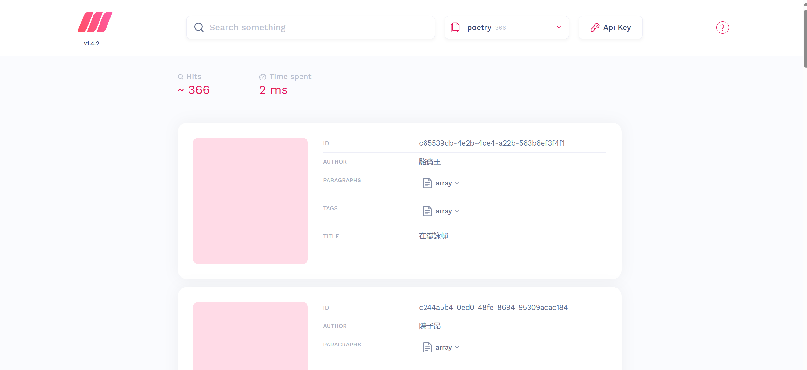
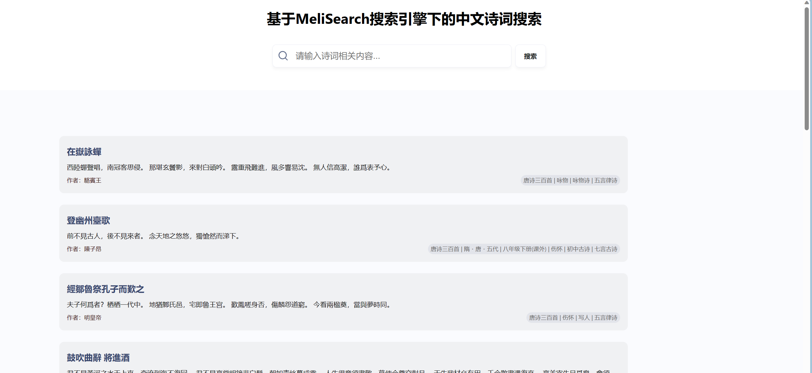

# 利用MeiliSearch制作中文诗词的搜索功能





## 数据集介绍

来源：[chinese-poetry](https://github.com/chinese-poetry/chinese-poetry)

内容：抓取了唐诗数据

## MeiliSearch介绍

> 一个搜索引擎

官网：[MeiliSearch](https://www.meilisearch.com/)

## 快速开始

```bash
# 方法一：用docker
# 进入到根目录，启动docker，确保docker已在你的后台运行
docker-compose up -d

# 找到名为 poetry-meilisearch的docker 容器，打开他的终端，查看它的 --master-key EXi1ty2AYiwoXXYEAyjr4ATv9T6gDbGhf2I6X-YHIcE
# 复制该 master-key，如 EXi1ty2AYiwoXXYEAyjr4ATv9T6gDbGhf2I6X-YHIcE
# 进入到根目录下的 index.js文件下，将 apiKey 替换为你自己的 master-key
# 进入到根目录下 web 文件夹下，找到 HomeView.vue 文件的apiKey，将 apiKey 替换为你自己的 master-key

# 方法二：下载MeiliSearch，终端启动MeiliSearch，复制它的master-key到项目中

# 进入到项目根目录下

# 添加数据库
npm install
npm run start

# 启动 web 页面
cd web
pnpm install
npm run dev
```

## 参考

* [MeiliSearch食用指南](https://juejin.cn/post/7161361328513220621)
* [MeiliSearch](https://www.meilisearch.com/)
* [poems-db](https://github.com/yxcs/poems-db.git)
* [chinese-poetry](https://github.com/chinese-poetry/chinese-poetry)
